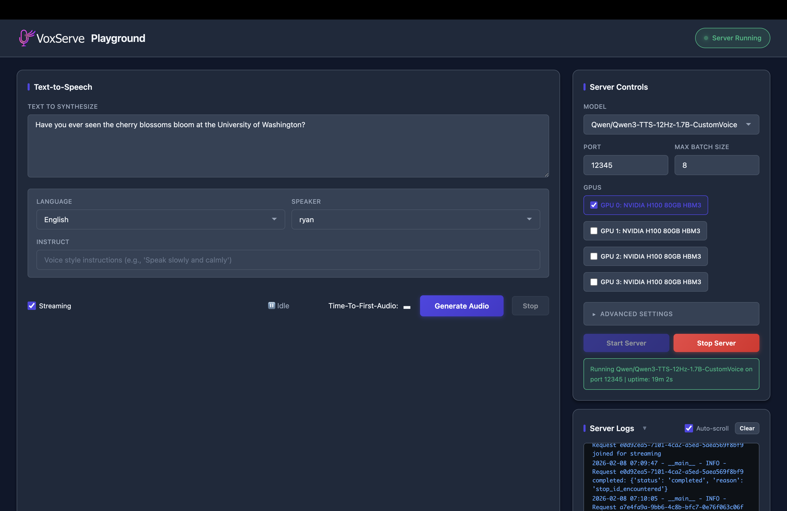

# VoxServe: a serving system for SpeechLMs

<p align="center">
  
</p>

<p align="center">
  <a href="https://arxiv.org/abs/2602.00269"></a>
  <a href="https://vox-serve.github.io/vox-serve/"></a>
</p>

VoxServe is a serving system for Speech Language Models (SpeechLMs). VoxServe provides low-latency & high-throughput inference for language models trained for speech tokens, specifically text-to-speech (TTS) and speech-to-speech (STS) models.

### News

- **[2025-02]** We released our paper: [VoxServe: A Streaming-Centric Serving System for Speech Language Models](https://arxiv.org/abs/2602.00269)

### Usage

You can install VoxServe via pip:

```bash
pip install vox-serve 
vox-serve --model <model-name> --port <port-number>
```

Or, you can clone the code and start the inference server with `launch.py`:

```bash
git clone https://github.com/vox-serve/vox-serve.git
cd vox-serve
python -m vox_serve.launch --model <model-name> --port <port-number>
```

And call the server like this:

```bash
# Generate audio from text
curl -X POST "http://localhost:<port-number>/generate" -F "text=Hello world" -F "streaming=true" -o output.wav

# For models supporting audio input
curl -X POST "http://localhost:<port-number>/generate" -F "text=Hello world" -F "@input.wav" -F "streaming=true" -o output.wav
```

We currently support the following TTS and STS models:

- `chatterbox`: [Chatterbox TTS](https://huggingface.co/ResembleAI/chatterbox)
- `cosyvoice2`: [CosyVoice2-0.5B](https://huggingface.co/FunAudioLLM/CosyVoice2-0.5B)
- `csm`: [CSM-1B](https://huggingface.co/sesame/csm-1b)
- `orpheus`: [Orpheus-3B](https://huggingface.co/canopylabs/orpheus-3b-0.1-ft)
- `qwen3-tts`: [Qwen3-TTS-1.7B](https://huggingface.co/collections/Qwen/qwen3-tts)
- `zonos`: [Zonos-v0.1](https://huggingface.co/Zyphra/Zonos-v0.1-transformer)
- `glm`: [GLM-4-Voice-9B](https://huggingface.co/zai-org/glm-4-voice-9b)
- `step`: [Step-Audio-2-Mini](https://huggingface.co/stepfun-ai/Step-Audio-2-mini)

And we are actively working on expanding the support.

`./examples` folder has more example usage.

### Playground

VoxServe includes a web-based playground for interactive testing. Start the playground server and use the browser UI to manage VoxServe, generate audio, and view real-time logs.



See [examples/playground/README.md](examples/playground/README.md) for details.
